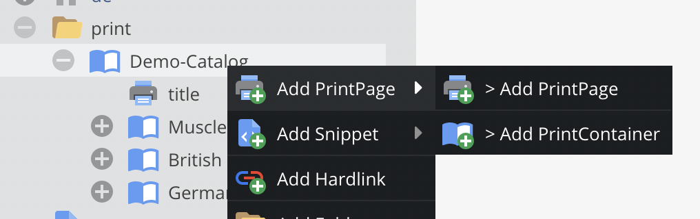
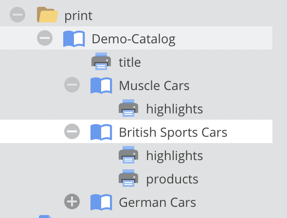

# Print Documents

Print documents are the way to create print-ready PDFs directly within OpenDXP. 
They are based on the normal OpenDXP documents and therefore support everything as pages do - starting from MVC pattern 
and template creation to document composing within OpenDXP backend with areas, drag&drop etc. 


Once activated, print documents are integrated into the default documents tree. 
But of course you can setup your custom views to have separate trees for web documents and print documents. 
Just use our completely redesigned [custom views](https://github.com/open-dxp/opendxp/blob/1.x/doc/05_Objects/01_Object_Classes/05_Class_Settings/20_Custom_Views.md) 
and all [new perspectives features](https://github.com/open-dxp/opendxp/blob/1.x/doc/18_Tools_and_Features/13_Perspectives.md).

For more detail-information on the settings see later.

## Web-To-Print Document Types

### PrintPage 

PrintPages are the documents that contain the actual content - with all the areas, editables, images, and so on. 
They are based on the normal OpenDXP documents and to content editing should be quite self explaining.



### PrintContainer

PrintContainers are a special document type to represent containers of PrintPages. They do not have content for their own, 
they just combine all sub pages to one single output PDF. By doing so they allow to structure big print documents like catalogs, 
pricelists, books, etc.

Of course, PrintContainers can be nested. So, one can use a root container, that contains several chapter containers 
that then contain the actual print pages.



Even they don't have content for their own, PrintContainers are based on normal OpenDXP documents. 
Therefore, they also need a controller and a view. They have to make sure, that all sub pages are included into one single output view. 
OpenDXP ships with default implementations (`Web2PrintController`, `containerAction`) in skeleton and demo installation package. 

## PDF Rendering

Both web-to-print documents have an additional tab that is the place for rendering documents to print-ready PDFs.
When rendering, the print is first rendererd to HTML, then rendered as a Twig template (yes, you can use Twig expressions in the document) and then rendered to an PDF. PDF rendering itself is done by an
third party renderer. Currently we support [pdfreactor](https://www.pdfreactor.com/) and [Gotenberg](https://gotenberg.dev/). 
Please see their documentation for details concerning template possibilities.

Depending on the renderer, there might be settings possible for the rendering process. 
The provided settings might be extended in future. 
For details of settings please see section below or renderer documentation.

### Sandbox Restrictions
Print document renders user controlled twig templates in a sandbox with restrictive
security policies for tags, filters & functions. Please use following configuration to allow more in template rendering:

```yaml
    opendxp:
          templating_engine:
              twig:
                sandbox_security_policy:
                  tags: ['if']
                  filters: ['upper']
                  functions: ['include', 'path']
```

## Special PDFreactor Settings

**Printermarks**: With PDFreactor there comes a out-of-the-box feature to add printermarks to the PDF. 
They can be activated by the printermarks rendering setting. Technically they are implemented by an additional CSS-file which needs to be included.

## Settings
In the web-to-print settings, the used PDF renderer is specified. Depending on the renderer, there are additional settings to be made. 
Additional explanation can be found directly in the settings form. 
These settings have to be set properly before starting PDF rendering.


## Relevant Log Files

If PDF rendering doesn't work properly, following log files should give you a hit for the reason.

* `var/log/dev.log` or `var/log/prod.log` - contains general logging information for rendering process at INFO level
* `var/log/web2print-output.log` - contains output of rendering PHP process (if any). It is recreated on every rendering process.

## Color management and images

If you are using the PDFReactor renderer, use CMYK CSS color specifications (see PDFReactor documentation on details).

There are two possible workflows for images:

1) Use print-ready source images (for example TIFF files with the correct ICC Profiles) in your documents with "Print (...)" thumbnail format setting. This keeps the colorspace correct when used for print rendering and converts to RGB for preview and edit-mode.

2) Keep RGB style PNG/Jpeg images in the CMYK PDF files and let the printing house take care of converting them to the correct colorspace.

Option 2) is preferred, as colorspace conversions are tricky and error-prone due to tightly coupled printer hardware dependencies.
